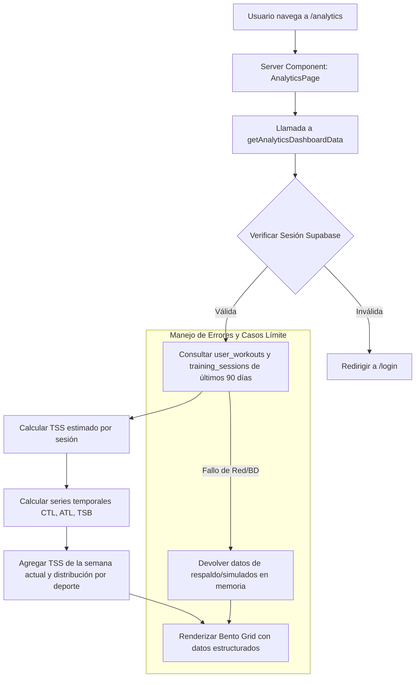

# Especificación Técnica: Módulo de Analíticas Avanzadas Unificado (Bento Grid)

## 1. Visión General y Objetivos
El objetivo de este módulo es proporcionar a los triatletas de la plataforma un panel de analíticas avanzado y unificado que combine las métricas de carga de entrenamiento (TSS) en una interfaz elegante de estilo **Bento Grid** bajo la estética *Minimal Luxury*.

El sistema unificará tres vistas clave de análisis en una única experiencia fluida:
1.  **Gestión de Rendimiento (PMC)**: Evolución de Fitness (CTL), Fatiga (ATL) y Forma (TSB).
2.  **Carga Semanal vs. Objetivo**: Cumplimiento del Training Stress Score acumulado en la semana en curso.
3.  **Distribución por Deporte**: Desglose porcentual y absoluto del esfuerzo dedicado a natación, ciclismo y carrera.

---

## 2. Arquitectura de Interfaz (Frontend)
El módulo residirá en una nueva ruta de la aplicación en `app/analytics/page.tsx` y utilizará componentes modulares ubicados en `components/analytics/`.

### 2.1 Estructura del Bento Grid (`app/analytics/page.tsx`)
El layout se organizará en una cuadrícula CSS (`grid grid-cols-1 md:grid-cols-2 gap-6`) con la siguiente distribución:

*   **Bloque 1: Performance Management Chart (Ancho Completo - `md:col-span-2`)**
    *   **Componente**: `PerformanceChartCard`
    *   **Descripción**: Gráfico principal de líneas estilizado con `framer-motion` o SVG dinámico que representa las curvas de CTL (azul celeste), ATL (rosa coral) y TSB (amarillo ámbar). Incluye selectores rápidos de rango temporal (4 semanas, 8 semanas, 12 semanas) y tarjetas de resumen con los valores actuales.

*   **Bloque 2: Carga Semanal vs. Objetivo (Mitad Izquierda - `md:col-span-1`)**
    *   **Componente**: `WeeklyTssCard`
    *   **Descripción**: Gráfico de barras vertical que muestra el TSS acumulado de lunes a domingo. Compara el total logrado frente a la meta calculada del plan de entrenamiento activo. Incluye un badge de estado ("Carga Óptima", "Sobrecarga", "Recuperación").

*   **Bloque 3: Distribución por Deporte (Mitad Derecha - `md:col-span-1`)**
    *   **Componente**: `SportDistributionCard`
    *   **Descripción**: Gráfico circular/anillo (Donut Chart) construido con SVG limpio que segmenta el TSS total de la semana entre Natación (morado), Ciclismo (azul) y Carrera (verde). Muestra porcentajes y puntos TSS exactos por disciplina.

---

## 3. Motor de Datos y Lógica de Negocio (Backend)
Toda la lógica de obtención, cálculo y agregación de datos se centralizará en un archivo de Server Actions: `app/analytics/analytics-actions.ts`.

### 3.1 Estructura de Datos y Modelo
El sistema utilizará las tablas existentes de Supabase (`profiles`, `training_plans`, `training_sessions`, `user_workouts`).

```typescript
export interface WorkoutAnalytics {
  id: string;
  scheduled_date: string;
  status: string; // 'completed' | 'pending' | 'skipped'
  duration_min: number;
  sport_type: string;
  description: string;
  calculated_tss: number;
}

export interface PmcPoint {
  date: string;
  ctl: number; // Fitness (Carga Crónica - 42 días)
  atl: number; // Fatiga (Carga Aguda - 7 días)
  tsb: number; // Balance de Forma (CTL - ATL)
}

export interface AnalyticsDashboardData {
  pmcData: PmcPoint[];
  currentCtl: number;
  currentAtl: number;
  currentTsb: number;
  weeklyTssActual: number;
  weeklyTssTarget: number;
  sportDistribution: {
    natacion: { tss: number; percentage: number };
    ciclismo: { tss: number; percentage: number };
    carrera: { tss: number; percentage: number };
  };
}
```

### 3.2 Algoritmo de Estimación de TSS
Dado que el JSON original de entrenamientos no incluye una columna explícita de TSS, el motor implementará un estimador algorítmico robusto basado en la duración y las palabras clave de intensidad en la descripción:

*   **Fórmula Base**: `TSS = (Duración_min / 60) * Factor_Intensidad * 100`
*   **Factores de Intensidad (IF) por palabra clave**:
    *   Si contiene "Zona 4", "Z4", "series", "fuerte", "umbral": `IF = 0.88` (Aprox. 77 TSS/hora).
    *   Si contiene "Zona 3", "Z3", "ritmo", "tempo": `IF = 0.80` (Aprox. 64 TSS/hora).
    *   Si contiene "Zona 1", "Z1", "recuperación", "suave": `IF = 0.65` (Aprox. 42 TSS/hora).
    *   Por defecto / "Zona 2", "Z2", "aeróbico": `IF = 0.75` (Aprox. 56 TSS/hora).

### 3.3 Modelo de Cálculo PMC (CTL, ATL, TSB)
Para generar el gráfico PMC, el sistema calculará las medias móviles exponenciales (EWMA) de los entrenamientos completados en los últimos 90 días:
*   **CTL (Carga Crónica / Fitness)**: Media móvil exponencial del TSS de los últimos 42 días (Constante de tiempo $\tau = 42$). Representa la capacidad física acumulada.
*   **ATL (Carga Aguda / Fatiga)**: Media móvil exponencial del TSS de los últimos 7 días (Constante de tiempo $\tau = 7$). Representa el cansancio reciente.
*   **TSB (Balance de Forma)**: Diferencia directa `CTL - ATL`. Un TSB positivo indica frescura (ideal para competir); un TSB muy negativo (< -25) indica riesgo de sobreentrenamiento.

---

## 4. Flujo de Datos y Manejo de Errores



### 4.1 Resiliencia y Casos Límite
1.  **Falta de Histórico en Usuarios Nuevos**: Si un usuario se acaba de registrar y tiene menos de 7 días de entrenamientos completados, el backend generará una curva de simulación de respaldo (basada en un atleta estándar con 50 CTL) para que el gráfico luzca espectacular desde el primer segundo, indicando visualmente que es un "Histórico Simulado de Calibración".
2.  **Errores de Conexión a Base de Datos**: Si Supabase falla o está inactivo, la función capturará la excepción y devolverá una estructura de datos válida en memoria, garantizando que la página nunca colapse con un error 500.

---

## 5. Estrategia de Verificación y Pruebas
1.  **Validación de Tipos**: Compilación estricta con `npx tsc --noEmit` para garantizar cero errores en las interfaces y props.
2.  **Pruebas de Componentes Visuales**: Verificación de renderizado en responsive (móvil, tablet, escritorio) asegurando que el Bento Grid mantiene las proporciones y el *Glassmorphism*.
3.  **Pruebas de Lógica de Cálculo**: Comprobación matemática de que la suma de los porcentajes de distribución por deporte da exactamente 100% y que `TSB` equivale exactamente a `CTL - ATL`.
