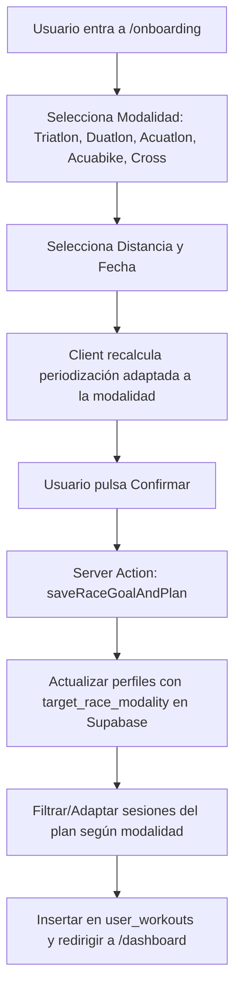

# Especificación Técnica: Soporte Multisport Total (Triatlón, Duatlón, Acuatlón, Acuabike y Cross)

## 1. Visión General y Objetivos
El objetivo de este módulo es expandir la plataforma de triatlón para dar soporte completo a todas las disciplinas derivadas del deporte múltiple (Multisport). Esto permitirá que atletas con preferencias específicas o restricciones físicas (como la imposibilidad de correr por impacto en rodillas) puedan utilizar la plataforma para preparar objetivos de Acuabike, Duatlón, Acuatlón o Triatlón Cross.

---

## 2. Arquitectura de Interfaz (Frontend)
El asistente de configuración de objetivos en `components/onboarding/race-finder.tsx` se enriquecerá con un nuevo nivel de selección de modalidad deportiva.

### 2.1 Selector de Modalidad (Modality Picker)
En la pestaña de `Desafío a Medida`, se incorporará un grid visual interactivo (`grid grid-cols-2 sm:grid-cols-5 gap-3`) con las 5 grandes disciplinas del deporte múltiple:

1.  **Triatlón**: `🏊 Natación + 🚴 Ciclismo + 🏃 Carrera`
2.  **Duatlón**: `🏃 Carrera + 🚴 Ciclismo + 🏃 Carrera` (Sin natación).
3.  **Acuatlón / Aquathlon**: `🏊 Natación + 🏃 Carrera` (Sin ciclismo).
4.  **Acuabike / Aquabike**: `🏊 Natación + 🚴 Ciclismo` (Sin carrera - Cero impacto).
5.  **Triatlón Cross / XTERRA**: `🏊 Natación + 🌲 BTT + 🏃 Trail Running` (Modalidad off-road).

### 2.2 Ampliación del Catálogo Oficial (`lib/races-data.ts`)
Se añadirán pruebas oficiales homologadas de estas disciplinas para que aparezcan instantáneamente en el buscador general:
*   *Campeonato del Mundo de Aquabike Pontevedra / Málaga* (Acuabike).
*   *Duatlón de Zuia / Campeonato de España de Duatlón* (Duatlón).
*   *XTERRA Costa Brava / XTERRA World Championship* (Triatlón Cross).
*   *Acuatlón Ciudad de Santander / Campeonato de España* (Acuatlón).

---

## 3. Motor de Datos y Lógica de Negocio (Backend)
Se adaptará la persistencia en base de datos y la asignación de planes en `app/onboarding/actions.ts`.

### 3.1 Esquema de Base de Datos y Tipos
Se creará un nuevo archivo de migración SQL (`supabase/migrations/20260517000002_race_modality.sql`) para añadir la columna `target_race_modality` a la tabla `profiles`:

```sql
ALTER TABLE profiles 
ADD COLUMN IF NOT EXISTS target_race_modality TEXT DEFAULT 'triatlon';
```

```typescript
export type MultisportModality = 'triatlon' | 'duatlon' | 'acuatlon' | 'acuabike' | 'cross';

export interface RaceCatalogItem {
  id: string;
  name: string;
  country: string;
  city: string;
  modality: MultisportModality;
  distance: 'sprint' | 'olimpico' | 'half' | 'full';
  month: string;
  estimatedDate: string;
  logoBg: string;
}
```

### 3.2 Lógica de Adaptación de Planes (`saveRaceGoalAndPlan`)
Al recibir el formulario con `target_race_modality`, la Server Action buscará el plan de entrenamiento que mejor se adapte tanto a la distancia como a la modalidad.
Si el atleta selecciona **Acuabike** o **Acuatlón**, el sistema filtrará o priorizará las sesiones específicas de esas disciplinas en el calendario del usuario (`user_workouts`), asegurando que un atleta de Acuabike no reciba entrenamientos de carrera a pie no deseados.

---

## 4. Flujo de Datos y Manejo de Errores



### 4.1 Resiliencia y Casos Límite
1.  **Falta de Plan Específico de Modalidad**: Si la base de datos de planes (`training_plans`) no tuviera un plan exclusivo de "Acuabike Full", el backend utilizará el plan de "Triatlón Full" como base y filtrará automáticamente en memoria las sesiones de carrera a pie (`run`), convirtiéndolas en sesiones de recuperación o ciclismo extra.
2.  **Valores por Defecto**: Si por algún motivo la modalidad llega vacía, el sistema asignará `triatlon` por defecto para garantizar que el flujo nunca falle.

---

## 5. Estrategia de Verificación y Pruebas
1.  **Validación de TypeScript**: Ejecución de `npx tsc --noEmit` para asegurar que el nuevo tipo `MultisportModality` está correctamente propagado en `database.types.ts`, `races-data.ts`, `actions.ts` y `race-finder.tsx`.
2.  **Pruebas de Filtrado en UI**: Verificación de que al escribir "Acuabike" o "Duatlón" en el buscador del catálogo, aparecen correctamente las pruebas correspondientes.
3.  **Pruebas de Persistencia**: Comprobación en la base de datos de Supabase de que la columna `target_race_modality` almacena correctamente la cadena seleccionada.
