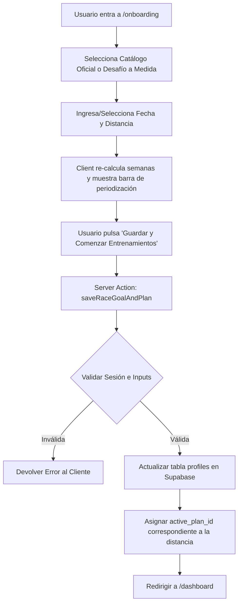

# Especificación Técnica: Onboarding Inteligente por Objetivos de Carrera (Race-Finder & Plan Generator)

## 1. Visión General y Objetivos
El objetivo de este módulo es revolucionar el proceso de Onboarding de la plataforma de triatlón, permitiendo a los atletas seleccionar o configurar su carrera objetivo en lugar de elegir un plan de entrenamiento estático y genérico.

Utilizando la terminología **Tactical / Performance (Opción 2)**, el sistema calculará dinámicamente las semanas restantes hasta la competición y generará una periodización a medida estructurada en cuatro bloques de rendimiento fisiológico.

---

## 2. Arquitectura de Interfaz (Frontend)
El módulo se integrará en la página existente `app/onboarding/page.tsx`, reemplazando la selección de planes estática por un flujo interactivo y avanzado.

### 2.1 Pestañas de Navegación del Asistente
El usuario podrá alternar entre dos modos de selección mediante pestañas estilizadas con *Glassmorphism*:

*   **Pestaña A: `Catálogo Oficial Homologado`**
    *   **Descripción**: Presenta una lista de tarjetas interactivas con triatlones icónicos predefinidos. Incluye un buscador en tiempo real para filtrar por nombre o ubicación.
    *   **Catálogo Base Inicial**:
        *   *Ironman 70.3 Valencia* (Media Distancia • Valencia, España • 20 Abril 2027)
        *   *Triatlón de Madrid* (Distancia Olímpica • Madrid, España • 15 Junio 2027)
        *   *Challenge Roth* (Larga Distancia • Roth, Alemania • 4 Julio 2027)
        *   *Ironman 70.3 Cascais* (Media Distancia • Cascais, Portugal • 18 Octubre 2027)

*   **Pestaña B: `Desafío a Medida`**
    *   **Descripción**: Formulario limpio para configurar cualquier carrera independiente.
    *   **Campos**:
        *   `raceName`: Nombre de la prueba (Input de texto).
        *   `raceDistance`: Selector de botones (Sprint, Olímpico, Half 70.3, Full Ironman).
        *   `raceDate`: Selector de fecha (Date picker con validación para evitar fechas pasadas).

### 2.2 Previsualización Dinámica de Periodización
Al seleccionar o configurar una carrera, aparecerá una tarjeta resumen destacando:
1.  **Cuenta atrás de semanas**: Cálculo exacto entre la fecha actual y el día de la prueba.
2.  **Barra de Periodización Visual**: Una barra de progreso segmentada en colores semánticos que ilustra la duración de cada una de las 4 fases de entrenamiento.

---

## 3. Motor de Datos y Lógica de Negocio (Backend)
Toda la lógica de cálculo, periodización y persistencia se gestionará mediante Server Actions en `app/onboarding/onboarding-actions.ts`.

### 3.1 Esquema de Base de Datos y Modelo
Se ampliará la tabla `profiles` en Supabase mediante una nueva migración SQL (`supabase/migrations/20260517000001_race_goals.sql`) para almacenar los objetivos del atleta:

```sql
ALTER TABLE profiles 
ADD COLUMN IF NOT EXISTS target_race_name TEXT,
ADD COLUMN IF NOT EXISTS target_race_date DATE,
ADD COLUMN IF NOT EXISTS target_race_distance TEXT;
```

```typescript
export interface RaceGoal {
  name: string;
  date: string;
  distance: 'sprint' | 'olimpico' | 'half' | 'full';
}

export interface PeriodizationPhase {
  name: string;
  durationWeeks: number;
  percentage: number;
  color: string;
  description: string;
}

export interface PeriodizationPlan {
  totalWeeks: number;
  phases: PeriodizationPhase[];
}
```

### 3.2 Algoritmo de Periodización Dinámica (Opción 2: Tactical / Performance)
Dada la fecha de la carrera $D_{race}$ y la fecha actual $D_{now}$, se calcula el número total de semanas disponibles $W_{total} = \lfloor (D_{race} - D_{now}) / (7 \times 24 \times 3600 \times 1000) \rfloor$.

Si $W_{total} < 4$, el sistema asignará un plan de "Puesta a punto exprés". Para $W_{total} \ge 4$, las semanas se distribuyen bajo la siguiente ponderación fisiológica:

1.  **`Acondicionamiento Anatómico` (30% de $W_{total}$)**
    *   **Color**: `#38bdf8` (Cyan).
    *   **Objetivo**: Adaptación tendinosa, volumen aeróbico en Z1/Z2 y trabajo de técnica base.
2.  **`Sobrecarga Progresiva` (40% de $W_{total}$)**
    *   **Color**: `#f59e0b` (Ámbar).
    *   **Objetivo**: Aumento escalonado del TSS semanal, series en tempo (Z3) y fuerza específica en subidas.
3.  **`Bloque de Intensidad Máxima` (20% de $W_{total}$)**
    *   **Color**: `#ef4444` (Rojo).
    *   **Objetivo**: Trabajo de umbral anaeróbico y VO2Max (Z4), entrenamientos de transición (brick) y ritmo de competición.
4.  **`Tapering Biométrica` (10% de $W_{total}$ o mínimo 1-2 semanas)**
    *   **Color**: `#10b981` (Esmeralda).
    *   **Objetivo**: Reducción del volumen (40-60%) manteniendo estímulos de alta intensidad para asegurar la supercompensación y un TSB positivo el día de la prueba.

---

## 4. Flujo de Datos y Manejo de Errores



### 4.1 Resiliencia y Casos Límite
1.  **Fechas Pasadas o Demasiado Próximas (< 2 semanas)**: El formulario de frontend impedirá seleccionar fechas en el pasado. Si el usuario selecciona una carrera a solo 1 o 2 semanas, el sistema mostrará un aviso de **"Modo Tapering Directo"**, ajustando la periodización para priorizar el descanso activo y evitar la fatiga antes de la prueba.
2.  **Fechas Muy Lejanas (> 52 semanas)**: Si la carrera está a más de un año vista, el sistema dividirá el calendario en dos macrociclos, indicando que las primeras semanas corresponderán a un "Macrociclo de Base Temprana".
3.  **Fallo de Conexión a Base de Datos**: Si Supabase falla al guardar, se capturará el error mostrando un toast informativo al usuario sin perder los datos del formulario.

---

## 5. Estrategia de Verificación y Pruebas
1.  **Validación Estricta de TypeScript**: Comprobación de tipos con `npx tsc --noEmit` para asegurar que las nuevas propiedades en `profiles` están perfectamente alineadas en todas las Server Actions.
2.  **Pruebas de Cálculo de Fechas**: Verificación matemática de que la suma de las semanas de las 4 fases da exactamente el total de semanas calculadas hasta la carrera.
3.  **Pruebas de Interfaz Responsive**: Comprobación visual en dispositivos móviles para asegurar que las pestañas y la barra de periodización se adaptan correctamente sin desbordamientos.
