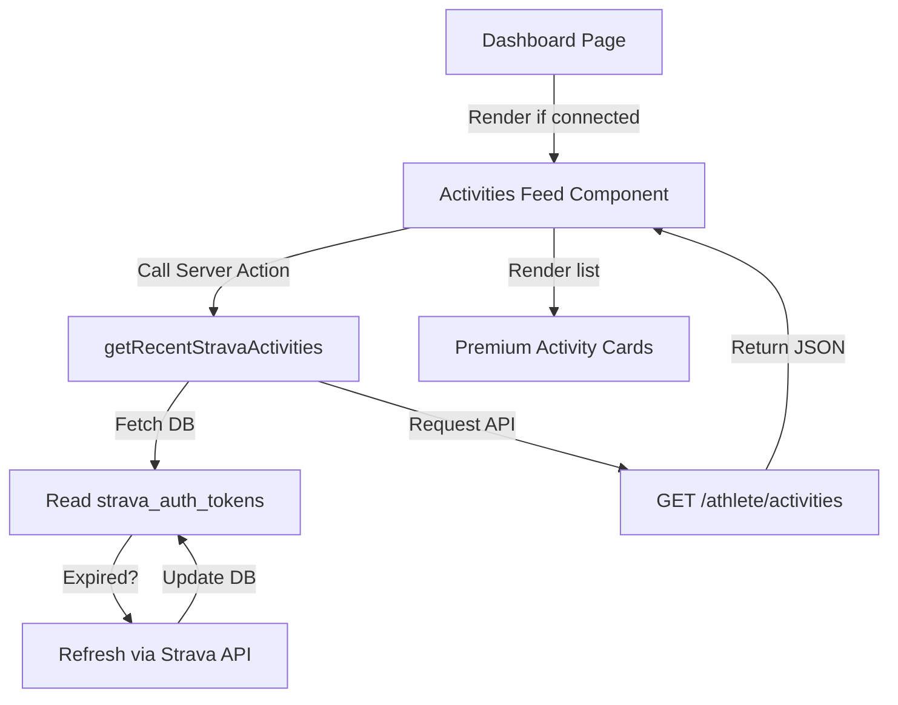

# Spec: Strava Activities Feed in Dashboard

Design specification for fetching and displaying the athlete's actual workouts synced from Strava directly at the bottom of the main Dashboard.

## 1. Goal & UX Strategy
The goal is to show the user a timeline/feed of their recent workouts imported from Strava (e.g. Garmin/Apple Watch runs, rides, and swims). This makes the dashboard feel alive, validates that telemetry is active, and displays which activities are linked to their training plan.

- **Placement:** Placed at the bottom of the main Dashboard (`app/dashboard/page.tsx`), visible only if `strava_connected` is true.
- **Fidelity:** Premium dark-mode glassmorphic cards with transition animations, tailored icons per sport (Waves for Swim, Bike for Cycling, Footprints for Running), and clear metrics (distance, duration, average pace/power).

## 2. Technical Implementation Details

### A. Database Access & Token Management
We will check if the user has `strava_connected` active in their profile. If they do:
1. Retrieve their `strava_auth_tokens` (JSONB field containing `access_token`, `refresh_token`, and `expires_at`).
2. If `expires_at` is in the past, execute an OAuth refresh call to `https://www.strava.com/oauth/token` with the client credentials.
3. Save the new access token back to the user's `profiles` record in the database.

### B. Server Action: `getRecentStravaActivities`
Expose a server action `getRecentStravaActivities()` in `app/telemetry/telemetry-actions.ts` that:
- Feeds off the valid access token.
- Calls `GET https://www.strava.com/api/v3/athlete/activities?per_page=10`.
- Returns a normalized array of activities containing:
  - `id`: Strava activity ID.
  - `name`: Activity title.
  - `type`: Sport type (Run, Ride, Swim, etc.).
  - `start_date`: Date and time of the workout.
  - `distance`: Distance in meters (converted to kilometers).
  - `moving_time`: Moving time in seconds (converted to hours/minutes).
  - `average_speed`: Average speed in m/s (converted to pace).
  - `average_watts`: Average power for rides (if available).

### C. Frontend Component: `ActivitiesFeed`
Create `components/dashboard/activities-feed.tsx` as a Client Component:
- Displays a skeleton loading state using Framer Motion while fetching.
- Formats dates using `toLocaleDateString` and times using clean split formatting.
- Automatically calculates and matches running pace (`min/km`) and swimming pace (`min/100m`).
- Provides a clean external link to open the activity in Strava (`https://www.strava.com/activities/[id]`).

## 3. Review Checklist
- [x] No placeholders or TBD items.
- [x] Fully integrated into existing design patterns (uses identical tailwind/framer-motion styles).
- [x] Rate limiting friendly: fetches max 10 items only on client mount.
